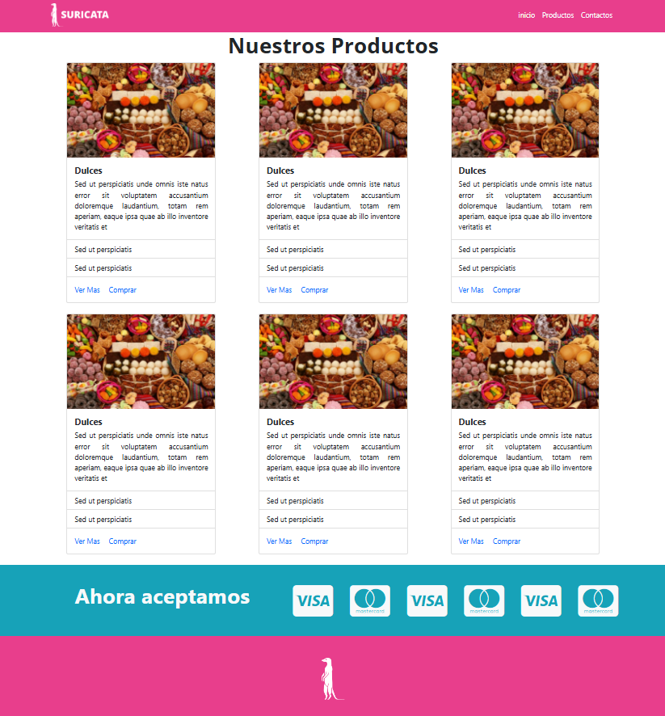

# **BASIC TEMPLATE WITH A SURICATA THEME**

## **Description**
With this template, you can practice Bootstrap by using the CDN and associated external scripts, as well as leveraging the framework's resources in building websites.

## **Technologies Used**
HTML5, CSS3, Bootstrap 5

## **Features**
- Construction of a responsive layout, considering Mobile First.
- Use of HTML and CSS.
- Implementation of Bootstrap and integration of its libraries.
- Use of Viewport to control the dimensions and scaling of the page.
- Creation of a Navbar with Bootstrap.
- Product Grid.

## **Screenshots**
<p align="center">
  
</p>

## **Installation**
1. Clone the repository:
   ```bash
   git clone https://github.com/yadicep/basic_template_suricata.git
